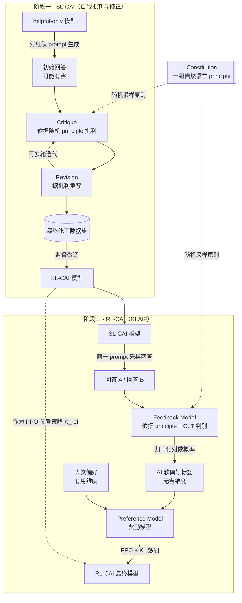

# Constitutional AI 技术详解

> **出处**：Anthropic，《Constitutional AI: Harmlessness from AI Feedback》(Bai et al., 2022, [arXiv:2212.08073](https://arxiv.org/abs/2212.08073))。
> 它直接建立在 Anthropic 早期 RLHF 与 HH（Helpful & Harmless，有用且无害）研究之上（[arXiv:2204.05862](https://arxiv.org/abs/2204.05862)）。
> 本文面向有 ML / RLHF 背景的读者，重点在方法机理与训练目标，而非泛科普。

## 目录

1. [背景与动机](#s1)
2. [方法总览（两阶段）](#s2)
3. [监督阶段 SL-CAI](#s3)
4. [强化阶段 RL-CAI（RLAIF）](#s4)
5. [Constitution（宪法）的构成](#s5)
6. [与 RLHF 的对比](#s6)
7. [效果与发现](#s7)
8. [局限与后续](#s8)
9. [CAI 与 DPO / 通用 RLAIF 的关系](#s9)
10. [一句话总结](#s10)
11. [参考文献](#sref)

> 锚点说明：目录采用显式 `<a id>` 锚点（埋于各标题行），在 VS Code / Cursor / Typora / Obsidian 等渲染器下可稳定跳转，不依赖各家不一致的 CJK 自动 slug。

---

## 1. 背景与动机 <a id="s1"></a>

### 1.1 RLHF 的可扩展性瓶颈

标准 RLHF（Reinforcement Learning from Human Feedback，人类反馈强化学习）依赖人工对成对回答打偏好标签来训练奖励模型。这套流程有三个结构性问题：

- **标注成本与不可扩展**：偏好数据量随能力需求线性甚至超线性增长，人力是硬约束。
- **标注者一致性差**：对"哪个更无害"的判断主观、跨标注者方差大，标准隐式埋在标注者脑子里，无法审查、无法版本化。
- **伦理代价**：为了训练无害性，需要人反复阅读、评判露骨有害内容（红队诱导出的回答），这本身对标注者有心理伤害。

### 1.2 helpful 与 harmless 的张力

仅以无害性为目标做对齐，会把模型推向 **evasive（回避式）** 失败模式：对任何稍敏感的问题一律拒答"I can't help with that"，既无害也无用。helpfulness 与 harmlessness 在朴素训练下相互拉扯，形成跷跷板。

### 1.3 CAI 的核心命题

把价值判断**从隐式的人工标签，转为一套显式、书面、可审查、可迭代的原则集合（constitution，宪法）**，并让模型依据这些原则自我监督。由此实现 **scalable oversight（可扩展监督）**：当模型能力增长、人类逐条审查成本不可承受时，监督仍可由"人定原则 + AI 执行判断"提供。

关键认知：CAI **不是把人踢出回路**，而是把人的介入点从"逐条标注内容"上移到"编写与修订宪法"。人依旧掌握价值标准，只是不再逐条阅读有害样本。

---

## 2. 方法总览（两阶段） <a id="s2"></a>

```
                    ┌─────────────────────────── Constitution（一组自然语言 principle） ──────────────────────────┐
                    │                                                                                              │
   阶段一 SL-CAI    ▼                                              阶段二 RL-CAI（RLAIF）                          ▼
  ┌───────────────────────────────┐                      ┌──────────────────────────────────────────────────────────┐
  │ helpful-only 模型对红队 prompt │                      │ SL-CAI 模型对同一 prompt 采样两个回答                       │
  │ 生成初始(可能有害)回答          │                      │            │                                              │
  │            │                   │                      │            ▼                                              │
  │            ▼ 依据随机抽取的     │                      │ feedback model 依据某条 principle + CoT 判断哪个更优       │
  │   principle 做 Critique(批判)   │                      │            │  → AI 偏好标签(软标签)                        │
  │            │                   │                      │            ▼                                              │
  │            ▼                   │   微调得到            │ 训练 Preference Model(奖励模型)：AI 无害偏好 + 人类有用偏好 │
  │       Revision(修正)            │ ───SL-CAI 模型──►    │            │                                              │
  │   (可多轮迭代)                  │                      │            ▼                                              │
  │            ▼                   │                      │ PPO 强化学习 → RL-CAI 最终模型                             │
  │  用最终 revision 数据微调       │                      │                                                          │
  └───────────────────────────────┘                      └──────────────────────────────────────────────────────────┘
```

一句话：**阶段一用"自我批判→自我修正"造监督数据并微调；阶段二把 RLHF 的人类无害偏好替换成 AI 无害偏好（RLAIF），再做 PPO。**

支持 Mermaid 渲染的查看器中，两阶段数据流如下：



---

## 3. 监督阶段 SL-CAI（Supervised Learning，自我批判与修正） <a id="s3"></a>

### 3.1 流程

1. **初始回答**：用一个仅经过 helpful 训练的模型（helpful-only RLHF 模型，本身缺乏无害约束），对红队（red-teaming）构造的诱导性 prompt 生成回答。这些回答常常是有害的——这是刻意的，要的是"待修正样本"。
2. **Critique（批判）**：从宪法中**随机抽取一条 principle**，提示模型依据该原则指出上一回答中有害/不当之处。例如原则："请指出回答中有害、不道德、种族歧视或非法的内容。"
3. **Revision（修正）**：再提示模型依据上一步的批判重写回答，去除有害成分。
4. **多轮迭代**：critique→revision 可重复多次，每轮可抽不同 principle，逐步收敛到更无害的版本。
5. **微调**：只保留**最终修正版**回答，与原 prompt 配对，构成监督数据集，对预训练模型做监督微调，得到 **SL-CAI 模型**。

### 3.2 为什么先做 SL 再做 RL

- **分布迁移**：SL 微调把模型输出分布提前拉近目标（既无害又不过度回避），缩短后续 RL 阶段需要跨越的距离。
- **训练稳定性**：RL（PPO）从一个已接近目标的策略出发，方差更小、更不易崩。论文明确指出 SL 阶段主要是为 RL "热身"，缩短训练、提升最终质量。

### 3.3 多样性来源

- **principle 随机采样**：每个样本批判时随机抽原则，使监督数据覆盖不同无害维度，避免模型只学会规避单一类型问题。
- **few-shot 提示**：critique / revision 步骤用少样本示例引导格式与风格，保证自我批判的可用性。

---

## 4. 强化阶段 RL-CAI（RLAIF，Reinforcement Learning from AI Feedback） <a id="s4"></a>

这是 CAI 最核心的替换：**把 RLHF 偏好数据里的"human feedback"换成"AI feedback"**，仅在无害性维度上替换，有用性仍用人类偏好。

### 4.1 AI 偏好数据生成

1. 用 SL-CAI 模型对同一 prompt 采样**两个候选回答**。
2. 构造一道多选题：把 prompt、两个回答、以及从宪法中抽取的一条 principle 组装进模板，交给 **feedback model（独立的预训练语言模型）** 判断"哪个回答更符合该原则"。
3. feedback model 输出对选项 (A)/(B) 的**归一化对数概率**，作为**软偏好标签**（soft label），而非硬 0/1。软标签保留判别置信度信息，对 PM 训练更友好。

### 4.2 关键工程技巧

- **Chain-of-Thought（CoT，思维链）**：让 feedback model 先逐步推理"为什么 A 比 B 更符合原则"再给结论，显著提升判别质量。这一步在原论文中对无害性评判准确率提升明显，是不可省略的环节。
- **位置偏置消除**：LM 对选项顺序敏感（倾向选 A 或 B）。通过交换 (A)/(B) 位置两次评估并平均，抵消 position bias。
- **principle 随机采样**：与 SL 阶段一致，每条偏好样本随机抽原则，使奖励信号覆盖完整宪法。

### 4.3 训练目标

**第一步：训练 Preference Model（PM，即奖励模型）。**
混合两类偏好对——AI 生成的**无害性**偏好 + 人类标注的**有用性**偏好——训练统一的 PM。设一个偏好对中较优回答为 $y_w$、较差为 $y_l$，PM 给出标量分 $r_\theta(x, y)$，采用 Bradley–Terry / logistic 偏好损失：

$$
\mathcal{L}_{\text{PM}}(\theta) = -\,\mathbb{E}_{(x,\,y_w,\,y_l)\sim \mathcal{D}}\Big[\log \sigma\big(r_\theta(x, y_w) - r_\theta(x, y_l)\big)\Big]
$$

其中 $\sigma$ 为 sigmoid。对于 AI 软标签，损失可推广为以软概率 $p$ 加权的交叉熵形式：

$$
\mathcal{L}_{\text{soft}}(\theta) = -\,\mathbb{E}\Big[\, p\,\log \sigma\big(\Delta r\big) + (1-p)\,\log \sigma\big(-\Delta r\big)\Big],\qquad \Delta r = r_\theta(x, y_A) - r_\theta(x, y_B)
$$

**第二步：PPO 强化学习。**
以 PM 为奖励信号，用 PPO 优化策略 $\pi_\phi$，并加 KL 惩罚把策略约束在 SL-CAI 初始策略 $\pi_{\text{ref}}$ 附近，防止 reward hacking 与分布漂移：

$$
\max_{\phi}\ \mathbb{E}_{x\sim\mathcal{D},\,y\sim\pi_\phi(\cdot\mid x)}\Big[\, r_\theta(x, y)\ -\ \beta\,\mathrm{KL}\big(\pi_\phi(\cdot\mid x)\,\|\,\pi_{\text{ref}}(\cdot\mid x)\big)\Big]
$$

$\beta$ 控制策略偏离参考分布的允许程度。训练完成得到 **RL-CAI 最终模型**。

---

## 5. Constitution（宪法）的构成 <a id="s5"></a>

- **形态**：一组**自然语言条款**，每条是一句对"何为更优回答"的指导，可直接插入 critique / 偏好评判模板。例如："选择更无害、更道德的回答；避免说教与过度反应。"
- **来源**：参考了《世界人权宣言》（UDHR）、信任与安全（trust & safety）的行业实践、以及对常见失败模式（如过度回避、说教）的针对性条款。
- **使用方式**：在 SL 与 RL 两阶段都通过**随机采样单条原则**注入，而非一次性堆叠全部。
- **人类控制入口**：宪法是人保留价值控制权的地方——**人编写并修订原则，AI 只执行逐条判断**。改变模型价值取向，只需改宪法文本，无需重标数据，这正是"可审查、可迭代"的来源。

---

## 6. 与 RLHF 的对比 <a id="s6"></a>

| 维度 | RLHF | Constitutional AI |
|------|------|-------------------|
| 无害性监督信号来源 | 人类偏好标签 | AI 依据宪法生成的偏好（RLAIF） |
| 有用性监督信号 | 人类偏好标签 | 仍为人类偏好标签 |
| 人工标注量 | 大（有用+无害都要标） | 显著减少（无害维度不再逐条人标） |
| 价值标准的可审查性 | 隐式、埋在标注者判断中 | 显式书面条款，可读可审 |
| 可迭代性 | 改标准需重新标注 | 改宪法文本即可 |
| 有害内容人工暴露 | 高（人需阅读评判） | 低（评判交给 AI） |
| 拒答行为 | 易 evasive | 更愿解释拒绝理由，较少一味回避 |

---

## 7. 效果与发现 <a id="s7"></a>

- **无害性达到或超过 RLHF**：RL-CAI 在无害性评测上与人类反馈训练的模型相当或更优。
- **更少回避、更透明**：CAI 模型倾向于**解释为什么拒绝**而非简单回避，缓解了 evasive 失败模式。
- **帕累托改进趋势**：在有用性—无害性的权衡前沿上，CAI 把曲线整体外推，而非单纯牺牲一方换另一方。
- **CoT 的价值**：带思维链的 AI 评判，其无害性判别与人类判断的一致性明显高于无 CoT 版本。

---

## 8. 局限与后续 <a id="s8"></a>

### 8.1 局限

- **谁来定宪法**：原则中的价值取舍由少数研究者拍板，正当性与代表性存疑。
- **feedback model 偏见继承**：用于评判的 LM 本身带训练数据偏见，可能把偏见固化进奖励信号。
- **reward hacking**：PM 是被优化的代理目标，策略可能钻 PM 漏洞；KL 惩罚只能缓解、不能根治。
- **原则覆盖盲区**：宪法未覆盖的危害类型，自我监督无法发现。

### 8.2 后续发展

- **Collective Constitutional AI（2023）**：Anthropic 与 Polis 合作，用公众参与的方式众包起草宪法，提升原则的民主正当性，并对比公众宪法与内部宪法训练出的模型差异。
- **RLAIF 的一般化**：CAI 验证了"AI 反馈替代人类反馈"的可行性，催生了更广义的 RLAIF 研究线（不限于无害性，也用于有用性、推理等），成为后续可扩展对齐方法的重要参照。

---

## 9. CAI 与 DPO / 通用 RLAIF 的关系 <a id="s9"></a>

### 9.1 在对齐方法谱系中的位置

把主流偏好对齐方法按"偏好信号来源 × 优化方式"摆开，CAI 的定位就清楚了：

| 方法 | 偏好信号来源 | 是否显式奖励模型 | 优化方式 |
|------|--------------|------------------|----------|
| RLHF (PPO) | 人类 | 是（PM） | PPO，在线采样 + KL 惩罚 |
| **CAI (RL-CAI)** | **AI 依宪法生成（无害）+ 人类（有用）** | **是（PM）** | **PPO，同 RLHF** |
| RLAIF（通用） | AI（不限维度） | 是 | PPO 或离线 |
| DPO | 任意（人类或 AI） | **否（隐式）** | 离线、闭式损失，无需采样 |

要点：**CAI 是 RLAIF 的开创性特例**——它首次系统验证"AI 反馈可在无害性上替代人类反馈"，但优化骨架仍是经典 RLHF（PM + PPO）。RLAIF 后续被推广到有用性、推理等更多维度，不再局限于无害与宪法。

### 9.2 CAI 与 DPO 是正交的

DPO（Direct Preference Optimization，直接偏好优化）的贡献在**优化侧**：它证明带 KL 约束的 RLHF 目标存在闭式最优解，可把"训 PM + 跑 PPO"压缩成一个直接在偏好对上最小化的监督式损失，省掉在线采样与显式奖励模型：

$$
\mathcal{L}_{\text{DPO}}(\phi) = -\,\mathbb{E}_{(x,y_w,y_l)}\Big[\log \sigma\Big(\beta\log\frac{\pi_\phi(y_w\mid x)}{\pi_{\text{ref}}(y_w\mid x)} - \beta\log\frac{\pi_\phi(y_l\mid x)}{\pi_{\text{ref}}(y_l\mid x)}\Big)\Big]
$$

而 CAI 的贡献在**数据侧**：偏好对从哪来（AI 依宪法自动产生）。两者关心的维度不同，因此**完全可组合**——用 CAI/RLAIF 的方式生成宪法偏好对，再用 DPO 而非 PPO 去优化，即得到一条"自我监督数据 + 轻量优化"的现代对齐流水线（业界常称 Constitutional-DPO 一类做法）。

### 9.3 实践取舍

- **要稳、要可控的在线行为**：沿用 CAI 原版的 PM + PPO，KL 惩罚显式可调。
- **要省算力、流程简单**：用 CAI 造数据 + DPO 优化，去掉 PPO 的采样与调参开销，代价是失去在线探索与 reward 重塑的灵活性。
- **共性约束**：两条路都强依赖**参考策略 $\pi_{\text{ref}}$**（即 SL-CAI 模型）的质量与 KL 锚定——这是阶段一 SL 微调不可省略的深层原因。

---

## 10. 一句话总结 <a id="s10"></a>

> **把"人工逐条打偏好标签"换成"人写一部宪法 + 模型照宪法自我批判、自我修正，并由 AI 依宪法生成偏好做 RL"——这就是 Constitutional AI 的本质：用显式原则换隐式标注，实现可扩展、可审查的对齐监督。**

---

## 参考文献 <a id="sref"></a>

1. Bai, Y., et al. *Constitutional AI: Harmlessness from AI Feedback.* Anthropic, 2022. [arXiv:2212.08073](https://arxiv.org/abs/2212.08073)
2. Bai, Y., et al. *Training a Helpful and Harmless Assistant with RLHF.* Anthropic, 2022. [arXiv:2204.05862](https://arxiv.org/abs/2204.05862)
3. Anthropic. *Collective Constitutional AI: Aligning a Language Model with Public Input.* 2023.
4. Rafailov, R., et al. *Direct Preference Optimization: Your Language Model is Secretly a Reward Model.* 2023. [arXiv:2305.18290](https://arxiv.org/abs/2305.18290)
5. Christiano, P., et al. *Deep Reinforcement Learning from Human Preferences.* 2017. [arXiv:1706.03741](https://arxiv.org/abs/1706.03741)（Bradley–Terry 偏好建模与 RLHF 范式源头）
