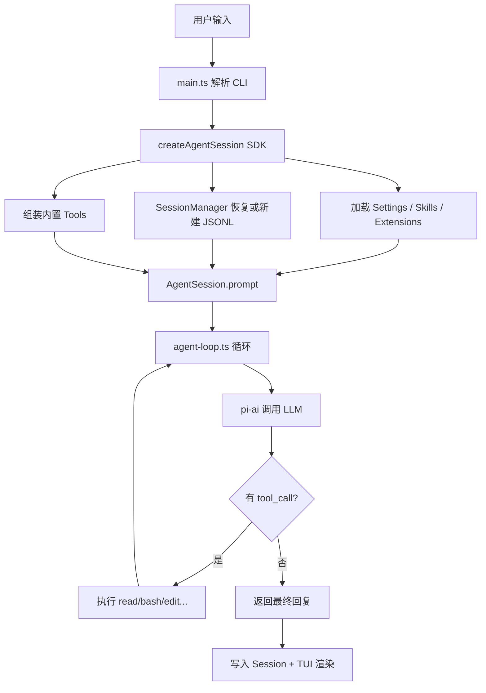

# Pi Coding Agent 学习指南

> 基于本地克隆仓库 `F:\AIInfra\pi` 的分析笔记。  
> 官网：[pi.dev](https://pi.dev) · 仓库：[github.com/earendil-works/pi](https://github.com/earendil-works/pi)

---

## 1. Pi 是什么

**Pi** 是一个极简的终端 Coding Agent Harness（编码智能体框架），作者是 Mario Zechner（libGDX 作者）。

核心理念：**核心保持最小，能力靠扩展拼装**。

和 Claude Code、Cursor Agent 等产品不同，Pi 刻意不内置子 Agent、Plan Mode、MCP、权限弹窗、TODO 系统——这些都可以通过 Extension、Skill 或第三方 Pi Package 自行添加。适合学习「Agent 最小内核 + 可插拔扩展」的架构设计。

### 1.1 设计立场速览

Pi 刻意不做 MCP、子 Agent、权限弹窗、Plan Mode 等——详见 **§2 核心设计哲学** 的出处标注表。

详细 rationale 见博客：[Pi Coding Agent](https://mariozechner.at/posts/2025-11-30-pi-coding-agent/)

---

## 2. 核心设计哲学（值得学的地方）

### 标注说明

| 标记 | 含义 |
|------|------|
| **📄 官方** | Pi 仓库 README 或 `docs/` 中有明确原文 |
| **🔧 源码归纳** | 官方文档未画总图/未串链路，需读源码才能得出 |
| **📝 学习笔记** | 对官方表述的概括（如「KISS 内核」），非 Pi 原文用词 |

### 五条哲学与出处

| # | 要点 | 标记 | 官方出处 |
|---|------|------|----------|
| 1 | **极简内核**：默认给模型 4 个工具（`read`、`write`、`edit`、`bash`）；完整内置列表共 7 个（再加 `grep`、`find`、`ls`） | 📄 官方 | `packages/coding-agent/README.md` Quick Start（约第 91 行）、CLI Reference「Available built-in tools」（约第 578 行） |
| 2 | **扩展优先**：子 Agent、MCP、权限门、Plan Mode 均不内置，用 TypeScript Extension / Skill / Package 自行拼装 | 📄 官方 | `README.md` Philosophy 小节（约第 486–502 行）；`docs/usage.md` Design Principles（约第 302–308 行）；`docs/extensions.md` 示例索引（`subagent/`、`plan-mode/`、`permission-gate.ts`） |
| 3 | **四种运行模式**：交互 TUI / 打印 `-p` / JSON 事件流 / RPC（stdin/stdout JSONL） | 📄 官方 | `README.md` 开篇（约第 19 行）；CLI Reference → Modes 表；`docs/rpc.md`、`docs/json.md` |
| 4 | **Session 是树，不是线**：JSONL 存会话，`id` + `parentId` 支持 `/tree` 跳转、`/fork` 分叉 | 📄 官方 | `docs/session-format.md` 开头；`docs/sessions.md`；`README.md` Sessions → Branching |
| 5 | **无 MCP 立场**：倾向 CLI + README + Skill，而非内置 MCP | 📄 官方 | `README.md` Philosophy「**No MCP**」+ [Why not MCP?](https://mariozechner.at/posts/2025-11-02-what-if-you-dont-need-mcp/) |

### 「KISS 内核」等概括性表述

| 表述 | 标记 | 说明 |
|------|------|------|
| 「KISS 内核」 | 📝 学习笔记 | 文档未用此四字；对应官方用语是 Philosophy / Design Principles 里的 *keeps the core small* |
| 「6 个内置工具」 | ❌ 不准确 | 应以官方为准：**默认 4 个，共 7 个**（见上表第 1 条） |

### 不做的事 → 替代方案（官方 Philosophy 原文）

| 不做的事 | 替代方案 | 标记 |
|----------|----------|------|
| 无 MCP | CLI 工具 + README（Skill），或 Extension 加 MCP | 📄 官方 |
| 无子 Agent | tmux 多实例，或 Extension / Package | 📄 官方 |
| 无权限弹窗 | 容器隔离，或 Extension 自定义确认流 | 📄 官方 |
| 无 Plan Mode | 写文件存计划，或 Extension / Package | 📄 官方 |
| 无内置 TODO | 用 `TODO.md`，或 Extension | 📄 官方 |
| 无后台 bash | 用 tmux，保持可观测性 | 📄 官方 |

---

## 3. Monorepo 四层架构

克隆的仓库是 monorepo，四层分工清晰：

| 包 | 路径 | npm 名 | 职责 |
|----|------|--------|------|
| **pi-ai** | `packages/ai` | `@earendil-works/pi-ai` | 统一多 Provider LLM API（Anthropic、OpenAI、Google、DeepSeek 等 30+） |
| **pi-agent-core** | `packages/agent` | `@earendil-works/pi-agent-core` | Agent 运行时：工具调用循环、状态管理、消息流 |
| **pi-tui** | `packages/tui` | `@earendil-works/pi-tui` | 终端 UI 库（差分渲染、编辑器、主题） |
| **pi-coding-agent** | `packages/coding-agent` | `@earendil-works/pi-coding-agent` | 面向用户的 CLI + SDK，组装上述三层 |

依赖关系：

```
coding-agent → agent-core → ai
coding-agent → tui
```

**学习重点包**：`packages/coding-agent`（产品层）+ `packages/agent`（循环内核）+ `packages/ai`（Provider 抽象）。

---

## 4. 四种运行模式

| 模式 | 触发方式 | 用途 |
|------|----------|------|
| **Interactive** | 默认 `pi` | 全功能 TUI，斜杠命令、快捷键、消息队列 |
| **Print** | `pi -p "..."` | 打印回复后退出，可管道 stdin |
| **JSON** | `pi --mode json` | 所有事件以 JSONL 输出，便于脚本消费 |
| **RPC** | `pi --mode rpc` | stdin/stdout JSONL 协议，非 Node 语言可集成 |

SDK 嵌入示例（最小）：

```typescript
import { AuthStorage, createAgentSession, ModelRegistry, SessionManager } from "@earendil-works/pi-coding-agent";

const authStorage = AuthStorage.create();
const modelRegistry = ModelRegistry.create(authStorage);
const { session } = await createAgentSession({
  sessionManager: SessionManager.inMemory(),
  authStorage,
  modelRegistry,
});

await session.prompt("What files are in the current directory?");
```

更多示例见 `packages/coding-agent/examples/sdk/`。

---

## 5. 一次请求的完整链路

> **⚠️ 本节为 🔧 源码归纳**：Pi 官方文档**没有**这张总流程图。各节点分散在 `docs/sdk.md`、`docs/sessions.md` 等；完整调用链需对照下方源码文件自行串联。

### 5.1 流程图（源码推导）



### 5.2 链路节点：官方文档 vs 源码

| 节点 | 标记 | 可查位置 |
|------|------|----------|
| `main.ts` 解析 CLI | 🔧 源码归纳 | `packages/coding-agent/src/main.ts`（文件头注释说明职责） |
| `createAgentSession()` | 📄 官方 + 🔧 实现 | API：`docs/sdk.md`；实现：`src/core/sdk.ts` |
| 加载 Settings / Skills / Extensions | 📄 官方（分散） | `docs/settings.md`、`docs/skills.md`、`docs/extensions.md` |
| `SessionManager` 恢复 JSONL | 📄 官方 | `docs/sessions.md`、`docs/session-format.md` |
| 组装内置 Tools | 📄 官方（部分） | `docs/sdk.md` 的 `tools` 参数；工厂函数见 `src/core/tools/` |
| `AgentSession.prompt` | 🔧 源码归纳 | `src/core/agent-session.ts`（用户文档未画进总图） |
| `agent-loop.ts` 循环 | 🔧 源码归纳 | `packages/agent/src/agent-loop.ts`；API 说明见 `packages/agent/README.md` |
| `pi-ai` 调 LLM | 🔧 源码归纳 | `packages/ai/src/`；`agent-loop.ts` 内 `streamSimple()` |
| tool_call 分支执行 | 🔧 源码归纳 | `agent-loop.ts` + `src/core/tools/*.ts` |
| 写入 Session + TUI 渲染 | 📄 官方（分散） | Session：`docs/session-format.md`；TUI：交互模式见 `README.md` Interactive Mode |

### 5.3 文字版链路（便于纯文本阅读）

```
用户输入
  → main.ts（CLI 参数解析）          [🔧 源码]
  → createAgentSession()（sdk.ts）   [📄 API + 🔧 实现]
  → 加载 Settings / Skills / Extensions
  → SessionManager 恢复或新建 JSONL [📄 官方]
  → 组装内置 Tools
  → AgentSession.prompt()            [🔧 源码]
  → agent-loop.ts（LLM ↔ 工具循环）  [🔧 源码]
  → pi-ai streamSimple()             [🔧 源码]
  → 执行 read / bash / edit / write / grep / find / ls
  → 结果写回 Session（JSONL）+ TUI 渲染
```

### 5.4 关键源码文件

| 顺序 | 文件 | 关注点 |
|------|------|--------|
| 1 | `packages/coding-agent/src/main.ts` | CLI 入口，参数 → SDK 选项 |
| 2 | `packages/coding-agent/src/core/sdk.ts` | `createAgentSession()` 组装一切 |
| 3 | `packages/coding-agent/src/core/agent-session.ts` | Session 驱动 Agent 循环 |
| 4 | `packages/agent/src/agent-loop.ts` | **核心**：LLM 与工具调用的 while 循环 |
| 5 | `packages/coding-agent/src/core/tools/` | 内置工具实现（read、bash、edit 等） |
| 6 | `packages/coding-agent/src/core/session-manager.ts` | JSONL 会话持久化 |
| 7 | `packages/coding-agent/src/core/extensions/` | Extension API 与事件总线 |
| 8 | `packages/ai/src/providers/` | 各 Provider 对接实现 |

`agent-loop.ts` 顶部注释点明了设计：

> Agent loop that works with `AgentMessage` throughout.  
> Transforms to `Message[]` only at the LLM call boundary.

即在 LLM 边界才做消息格式转换，内部统一用 Agent 层消息类型。

### 5.5 内置工具

默认启用：`read`、`write`、`edit`、`bash`。扩展集：`grep`、`find`、`ls`。

工具实现目录：`packages/coding-agent/src/core/tools/`

---

## 6. 四大扩展机制

| 机制 | 是什么 | 典型路径 | 学什么 |
|------|--------|----------|--------|
| **Skills** | Markdown 能力包（[Agent Skills 标准](https://agentskills.io)） | `~/.pi/agent/skills/`、`.pi/skills/` | 按需加载的领域知识与工作流 |
| **Extensions** | TypeScript 模块：工具、命令、事件、UI | `~/.pi/agent/extensions/`、`.pi/extensions/` | 拦截 tool_call、注册自定义工具 |
| **Prompt Templates** | 可复用提示词模板 | `~/.pi/agent/prompts/` | `/review` 类快捷命令 |
| **Pi Packages** | npm/git 打包分发上述资源 | `pi install npm:@foo/pi-tools` | 生态分发与版本管理 |

### 6.1 Extension 能力一览

- `pi.registerTool()` — 注册 LLM 可调用的自定义工具
- `pi.registerCommand()` — 注册 `/command` 斜杠命令
- `pi.on("tool_call", ...)` — 拦截/阻断工具调用
- `pi.on("session_start", ...)` — 生命周期钩子
- `ctx.ui.notify / confirm / select` — TUI 用户交互
- `pi.appendEntry()` — 跨重启的 Session 状态

文档：`packages/coding-agent/docs/extensions.md`  
示例：`packages/coding-agent/examples/extensions/`（60+ 个）

**推荐示例**：

| 示例 | 路径 | 说明 |
|------|------|------|
| 子 Agent | `examples/extensions/subagent/` | 自行实现多 Agent 协作 |
| 路径保护 | `examples/extensions/protected-paths.ts` | 阻断危险写操作 |
| 自定义压缩 | `examples/extensions/summarize.ts` | 替换默认 compaction |
| 沙箱 | `examples/extensions/sandbox/` | 容器化隔离 |
| Gondolin | `examples/extensions/gondolin/` | 主机 pi + 微 VM 工具路由 |

### 6.2 Extension 最小骨架

```typescript
import type { ExtensionAPI } from "@earendil-works/pi-coding-agent";

export default function (pi: ExtensionAPI) {
  pi.on("tool_call", async (event, ctx) => {
    if (event.toolName === "bash" && event.input.command?.includes("rm -rf")) {
      const ok = await ctx.ui.confirm("Dangerous!", "Allow rm -rf?");
      if (!ok) return { block: true, reason: "Blocked by user" };
    }
  });
}
```

---

## 7. Session 系统（Pi 的亮点）

- **存储位置**：`~/.pi/agent/sessions/`，按工作目录组织
- **格式**：JSONL **树结构**，每条记录有 `id` + `parentId`
- **分支**：`/tree` 在历史任意节点继续，不丢完整历史
- **分叉**：`/fork` 从某条用户消息创建新 Session
- **压缩**：`/compact` 有损摘要旧消息；完整历史仍在 JSONL 中
- **导出**：`/export` → HTML，便于复盘与分享

相关文档：`packages/coding-agent/docs/session-format.md`、`docs/compaction.md`

常用 CLI：

```bash
pi -c                  # 继续最近 Session
pi -r                  # 浏览历史 Session
pi --no-session        # 临时模式，不保存
pi --fork <id>         # 从已有 Session 分叉
```

---

## 8. 配置与上下文

### 8.1 设置层级

| 位置 | 作用域 |
|------|--------|
| `~/.pi/agent/settings.json` | 全局 |
| `.pi/settings.json` | 项目（覆盖全局） |

### 8.2 上下文文件

启动时自动加载 `AGENTS.md` / `CLAUDE.md`：

- `~/.pi/agent/AGENTS.md`（全局）
- 从 cwd 向上遍历的父目录
- 当前目录

系统提示词：`.pi/SYSTEM.md`（项目）或 `~/.pi/agent/SYSTEM.md`（全局）

### 8.3 项目信任（Project Trust）

交互模式下，含 `.pi/` 或项目 Skills 的目录会提示是否信任。信任后才加载项目级 Extension 和设置。非交互模式用 `--approve` / `--no-approve` 覆盖。

---

## 9. Provider 与模型

`pi-ai` 统一对接 30+ Provider，支持：

- **订阅 OAuth**：Anthropic Claude Pro/Max、OpenAI ChatGPT、GitHub Copilot
- **API Key**：Anthropic、OpenAI、Google、DeepSeek、OpenRouter、Groq 等

自定义 Provider：`~/.pi/agent/models.json` 或 Extension 注册。

文档：`packages/coding-agent/docs/providers.md`、`docs/models.md`

---

## 10. 与 Claude Code / Cursor 对比

| 维度 | Pi | Claude Code / Cursor |
|------|----|-----------------------|
| 核心体积 | 极小，默认 4 工具 / 共 7 内置 | 功能全内置 |
| 定制方式 | Extension / Skill / Package | 主要改配置或等官方 |
| 嵌入能力 | SDK + RPC，可嵌进自己的 App | 主要是独立产品 |
| 子 Agent | 自己写 Extension | 部分已内置 |
| 开源 | MIT，全源码可读 | 闭源或部分开源 |
| 权限模型 | 无内置，靠容器或 Extension | 部分产品有确认流 |

**结论**：Pi 是「可 fork、可嵌入的 Agent 框架」；Claude Code 是「开箱即用的产品」。学架构设计选 Pi；学产品体验选 Claude Code。

---

## 11. 本地开发与环境

### 11.1 环境要求

- Node.js >= 22.19.0
- 仓库根目录：`F:\AIInfra\pi`

### 11.2 从源码构建

```powershell
cd F:\AIInfra\pi
npm install --ignore-scripts
npm run build
.\scripts\pi-learn.ps1    # fork 默认：带 -nc，不自动加载 AGENTS/CLAUDE
```

### 11.5 Fork 默认：`-nc`（不加载上下文文件）

本 fork 在 `AGENTS.md` / `CLAUDE.md` 上叠了 harness 事/法/设。为避免 pi 运行时**自动注入**这些协作规则、干扰「读源码学架构」，**默认用 `-nc`**。

| 标志 | 作用 |
|------|------|
| `-nc` / `--no-context-files` | 不自动加载 `AGENTS.md`、`CLAUDE.md`（pi 官方开关） |
| 默认包装脚本 | `scripts/pi-learn.ps1`（Windows）、`scripts/pi-learn.sh`（Git Bash）已内置 `-nc` |

**默认（推荐学习 pi 内核）：**

```powershell
# PowerShell 需在 pi 参数前加 --，否则 -p 会被 PS 自己解析
.\scripts\pi-learn.ps1 -- -p "Explain agent-loop.ts briefly"
.\scripts\pi-learn.ps1 --          # 交互 TUI，同样 -nc
```

```bash
./scripts/pi-learn.sh -p "List packages/coding-agent/src/core/tools"
```

**需要加载 fork 协作规则时（显式 opt-in）：**

```powershell
.\scripts\pi-learn.ps1 -WithContext -- -p "按 CLAUDE.md 协作规范回答"
.\pi-test.sh -p "..."               # 等价于不用 -nc（Git Bash）
```

验证 `-nc` 是否生效（无需 API Key）：

```powershell
node node_modules/tsx/dist/cli.mjs scripts/verify-pi-learn-nc.mjs
# 末尾应输出 VERIFY_OK
```

**说明：**

- `-nc` 只关 context files；**不关** skills、extensions、`.pi/` 下配置。
- `DESIGN.md` 本就不会被 pi 自动加载；需要时让 agent `read` 或你在 Cursor 里 @ 引用。
- 全局安装的 `pi` 命令：在 fork 目录下手动加 `-nc`，或用上述包装脚本。

### 11.3 测试

```powershell
.\test.sh             # 不需要 API Key 的非 LLM 测试
npm test              # 全量测试（部分需 API Key）
```

### 11.4 安装使用（非源码）

```bash
npm install -g --ignore-scripts @earendil-works/pi-coding-agent
# 或
curl -fsSL https://pi.dev/install.sh | sh
```

Windows 专项：`packages/coding-agent/docs/windows.md`

---

## 12. 推荐学习路径（由浅入深）

### 阶段 1：跑起来，感受产品

1. 构建并运行 `.\scripts\pi-learn.ps1`（默认 `-nc`）
2. 配置 `ANTHROPIC_API_KEY` 或 `/login`
3. 试 `/tree`、`/compact`、`/export`、`/model`

### 阶段 2：读 SDK 示例（最省时间）

按编号阅读 `packages/coding-agent/examples/sdk/`：

| 文件 | 主题 |
|------|------|
| `01-minimal.ts` | 最小嵌入 |
| `05-tools.ts` | 工具 allowlist / denylist |
| `06-extensions.ts` | 加载 Extension |
| `11-sessions.ts` | 会话管理 |
| `12-full-control.ts` | 完全控制 |
| `13-session-runtime.ts` | 多 Session Runtime |

### 阶段 3：读核心源码

1. `packages/agent/src/agent-loop.ts` — Agent 主循环
2. `packages/coding-agent/src/core/tools/read.ts` + `bash.ts` — 工具契约
3. `packages/coding-agent/src/core/agent-session.ts` — Session 驱动
4. `packages/coding-agent/src/core/extensions/` — 事件与 API
5. `packages/ai/src/providers/anthropic.ts` — 单 Provider 实现样例

### 阶段 4：动手写 Extension

1. 在 `~/.pi/agent/extensions/my-ext.ts` 写权限门
2. 对照 `protected-paths.ts` 和 `docs/extensions.md`
3. `/reload` 热加载验证

### 阶段 5：读测试与文档

- 测试：`packages/coding-agent/test/`、`packages/agent/test/`
- 文档目录：`packages/coding-agent/docs/`
- RFC 长期规划：[rfc.earendil.com/keyword/pi](https://rfc.earendil.com/keyword/pi/)

---

## 13. 文档索引（仓库内）

| 文档 | 路径 |
|------|------|
| 产品 README（含 Philosophy） | `packages/coding-agent/README.md` |
| 根 README | `README.md` |
| 用法与设计原则 | `packages/coding-agent/docs/usage.md` |
| Sessions | `packages/coding-agent/docs/sessions.md` |
| Extension | `packages/coding-agent/docs/extensions.md` |
| SDK | `packages/coding-agent/docs/sdk.md` |
| RPC 协议 | `packages/coding-agent/docs/rpc.md` |
| Session 格式 | `packages/coding-agent/docs/session-format.md` |
| Compaction | `packages/coding-agent/docs/compaction.md` |
| 开发指南 | `packages/coding-agent/docs/development.md` |
| 容器化 | `packages/coding-agent/docs/containerization.md` |
| Windows | `packages/coding-agent/docs/windows.md` |

---

## 14. 安全提示

- Pi **无内置权限系统**，以启动用户权限运行
- Extension 和 Pi Package 拥有**完整系统访问权**，安装第三方包前务必审源码
- 需要隔离时：Docker、Gondolin Extension、OpenShell（见 `containerization.md`）

---

## 15. 延伸阅读

- [pi.dev 文档](https://pi.dev/docs/latest)
- [Pi Coding Agent 博客](https://mariozechner.at/posts/2025-11-30-pi-coding-agent/)
- [Why not MCP?](https://mariozechner.at/posts/2025-11-02-what-if-you-dont-need-mcp/)
- [openclaw/openclaw](https://github.com/openclaw/openclaw) — 真实 SDK 集成案例

---

*文档更新：2026-06-25 · 基于 pi v0.80.2 · §2 出处标注 + §5 源码推导流程图*